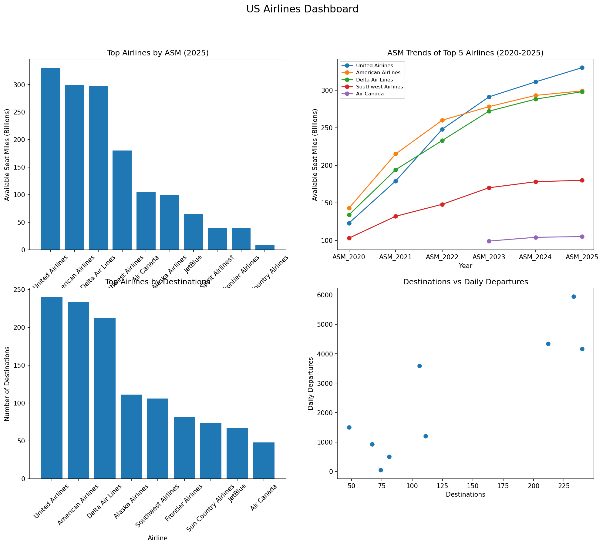

# US Airlines Wikipedia Web Scraping and Analysis

## Overview

This project focuses on collecting and analyzing data on major US airlines using publicly available information from Wikipedia. The data was scraped, cleaned and transformed into a structured dataset, followed by exploratory analysis and visualization of key airline metrics.

The project was built to practice working with real-world data and to understand the complete workflow of a data project, from data collection to generating insights.

---

## Dataset Source

**Wikipedia – List of Largest Airlines in North America**["https://en.wikipedia.org/wiki/List_of_largest_airlines_in_North_America"]


The dataset includes information such as:
- Airline names
- Available Seat Miles (ASM)
- Passenger statistics
- Destinations served
- Daily departures
- Airline rankings

---

## Technologies Used

- Python
- Requests
- BeautifulSoup
- Pandas
- Matplotlib
- Jupyter Notebook

---

## Project Structure

```text
US-Airlines-Wikipedia-Web-Scraping-and-Analysis
│
├── data/
│   ├── us_airlines.csv
│   ├── cleaned_airlines.csv
│   ├── airlines_table_1.csv
│   ├── airlines_table_2.csv
│   ├── airlines_table_3.csv
│   └── airlines_table_4.csv
│
├── images/
│   └── airlines_analysis.png
│
├── notebooks/
│   ├── web_scraping.ipynb
│   └── cleaning_and_visualization.ipynb
│
├── requirements.txt
├── .gitignore
└── README.md
```

---

## Workflow

1. Scraped airline data from Wikipedia tables using `requests` and `BeautifulSoup`.
2. Converted the extracted data into CSV files and then merged all files to a single file.
3. Cleaned and preprocessed the dataset by handling missing values and converting columns to appropriate data types.
4. Performed exploratory analysis on airline statistics.
5. Created visualizations to compare airline performance and operational metrics.

---

## Analysis Performed

- Comparison of airlines by Available Seat Miles (ASM).
- Passenger statistics analysis.
- Destinations served by each airline.
- Daily departures comparison.
- Airline ranking analysis.

---

## Visualization



---

## How to Run the Project

### Clone the Repository

```bash
git clone https://github.com/yourusername/US-Airlines-Wikipedia-Web-Scraping-and-Analysis.git
```

### Install Dependencies

```bash
pip install -r requirements.txt
```

### Run the Notebooks

Open the notebooks and run the cells in order.

---

## What I Learned

- Web scraping using BeautifulSoup
- Working with real-world datasets
- Data cleaning and preprocessing with Pandas
- Exploratory data analysis and visualization
- Organizing and documenting an end-to-end data project

---

## Author

**Purti**
[LinkedIn](https://www.linkedin.com/in/purtimittal) | [Check my portfolio](https://purtimittal.github.io/Portfolio/) | [Email](m.purtimittal@gmail.com)
